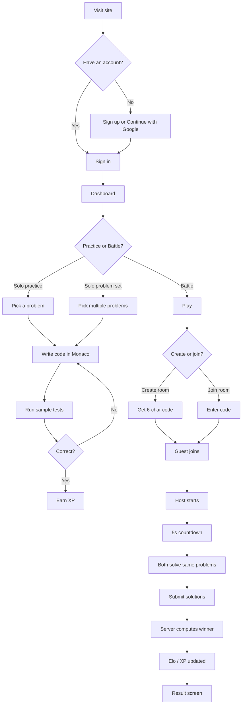
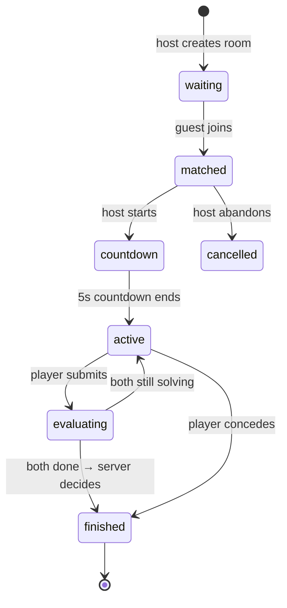
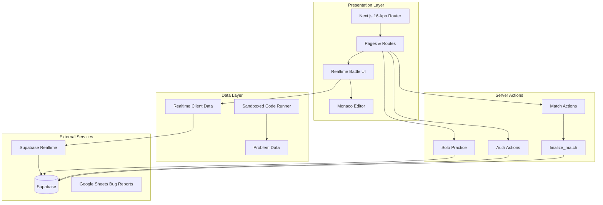
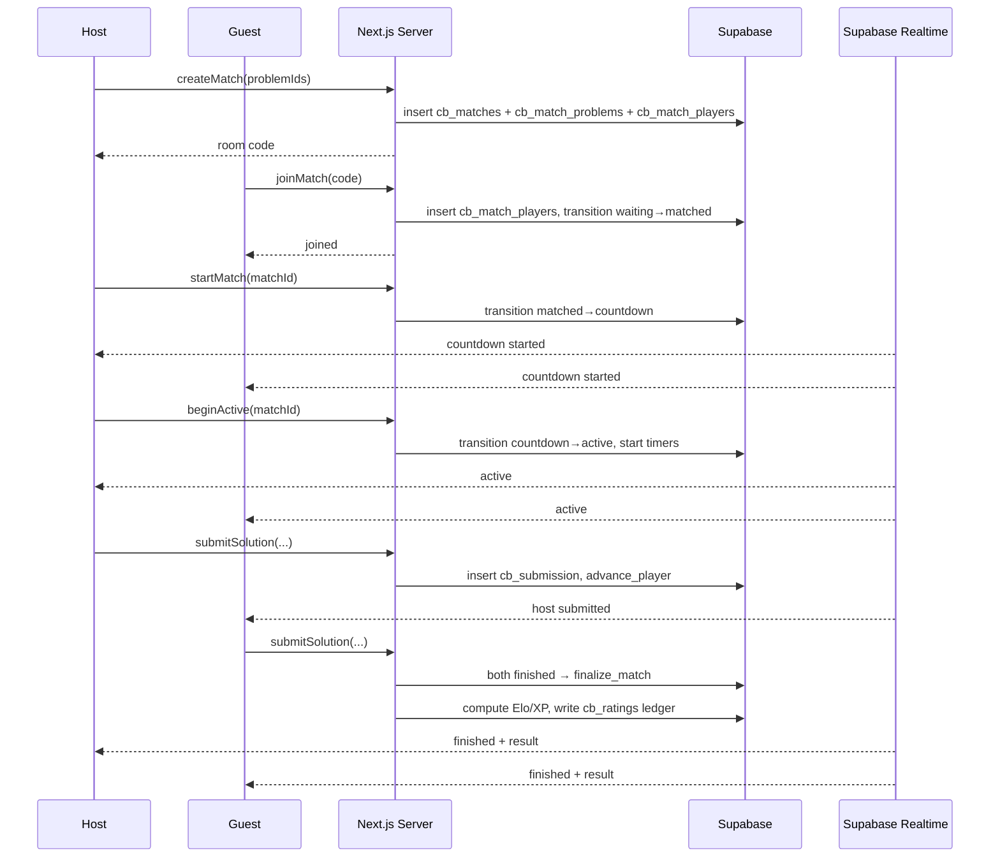
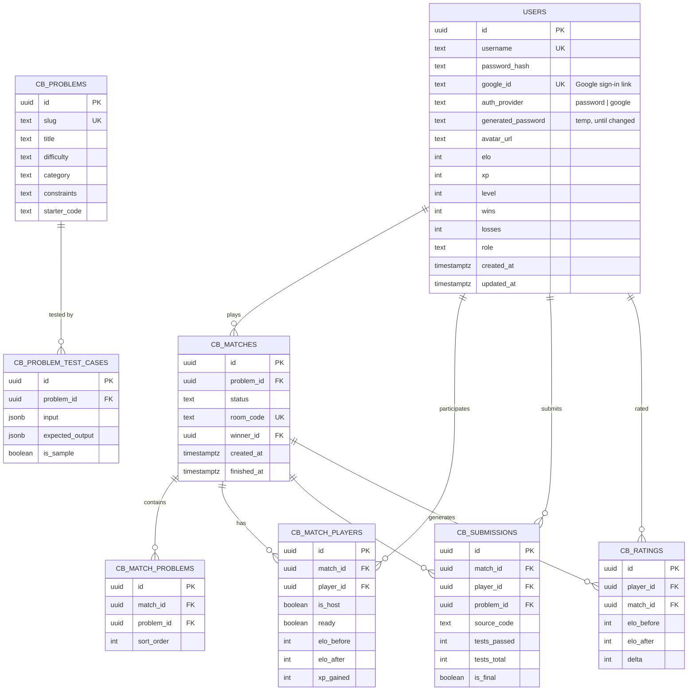

<div align="center">

# Code Battle

### Real-time coding battles against real developers

[](./LICENSE)
[](https://nextjs.org/)
[](https://www.typescriptlang.org/)
[](https://supabase.com/)

**Practice coding interviews by competing against real developers — face off on the same problems, under the same clock, in real time across devices.**

[Features](#features) · [User Flow](#user-flow) · [How a Battle Works](#how-a-battle-works) · [Database Schema](#database-schema) · [Security Model](#security-model) · [Quick Start](#quick-start) · [Tech Stack](#tech-stack) · [Contributing](#contributing)

</div>

---

## Features

| Feature | Description |
|---------|-------------|
| **Real-Time Battles** | Face a friend on the same problem set, under the same clock |
| **Multi-Problem Sets** | Host picks one or more problems for a match |
| **Monaco Editor** | Full-featured code editor with syntax highlighting |
| **JavaScript Runner** | Sandboxed execution with per-test timeouts and instant sample-test feedback |
| **Sandboxed Execution** | Run sample tests instantly in an isolated sandbox |
| **ELO Rating System** | Server-authoritative Elo rating that updates after every match |
| **XP & Levels** | Earn XP for correct solo solutions and match wins |
| **Leaderboard** | Global ranking by Elo across all players |
| **Solo Practice** | Practice single problems or curated problem sets alone |
| **Realtime Sync** | Live match state via Supabase Realtime (with polling fallback) |
| **Google Sign-In** | Continue with Google - one account works across all apps |
| **Profile Avatars** | Google profile picture everywhere, with initial fallbacks |

---

## User Flow



---

## How a Battle Works



1. **Host creates a room** — picks one or more problems and gets a **6-character code**.
2. **Guest joins** with the code from anywhere.
3. **Host starts** the match → a **5s countdown** → both players get the same problem set.
4. **Both write code** in Monaco, run sample tests, and submit each problem.
5. When **both players finish**, the server computes the winner (correctness, then time) and calls `finalize_match` — a `SECURITY DEFINER` function that atomically updates **Elo, XP, and the immutable ratings ledger**.
6. Both players see the **result screen**, and the leaderboard updates instantly.

If a player concedes, the opponent is awarded the win. Solo practice creates a single-player match and awards XP scaled by difficulty and test-case pass rate (easy 10 / medium 20 / hard 30).

---

## Architecture



### Request Flow



### Key Design Decisions

- **Server-authoritative outcomes.** Match results, Elo, and XP are computed only by `SECURITY DEFINER` Postgres functions — the client can never forge a win or edit its rating.
- **Realtime state machine.** The match lifecycle (`waiting → matched → countdown → active → finished`) is driven by Supabase Realtime subscriptions, so both players stay in sync without polling.
- **Sandboxed execution.** User code runs in an isolated `new Function` scope (no DOM, no `localStorage`, no network) with a per-test timeout.
- **Race-safe submissions.** A unique partial index allows only one final submission per player per problem, so simultaneous submits can't double-score.
- **Shared identity.** The `users` table is shared with **Interview Handbook**, so a single account works across both apps.
- **Shared session (optional).** With `COOKIE_DOMAIN=.tejaverse.org` set in production, the same JWT session cookie is shared, so signing in to one app keeps you signed in to the other. Interview Handbook links to Code Battle from its navbar.

---

## Database Schema

The app runs on a shared Supabase PostgreSQL database (the `users` table is shared with **Interview Handbook**). Row Level Security is enabled on every table. To avoid collisions in the shared DB, Code Battle prefixes its tables with `cb_` (CodeTrace uses `ct_`, Interview Handbook uses `ih_`).



### Table Reference

| Table | Purpose |
|-------|---------|
| `users` | Shared identity table (username + bcrypt hash or Google link, Elo, XP, levels, streaks, role, avatar). |
| `cb_problems` | Coding problems with difficulty, category, constraints, starter code. |
| `cb_problem_test_cases` | Input/output test cases per problem. |
| `cb_matches` | Battle state machine (`waiting → matched → countdown → active → evaluating → finished`). |
| `cb_match_problems` | Ordered list of problems in a match (multi-problem battles). |
| `cb_match_players` | Per-player match state — Elo before/after, XP gained. |
| `cb_submissions` | Code submissions with test results. A unique partial index allows only one final submission per player per problem. |
| `cb_ratings` | Immutable Elo ledger — insert-only, server-written. |

### Postgres Functions

| Function | Purpose |
|----------|---------|
| `get_password_hash` | SECURITY DEFINER — reads a user's bcrypt hash for login (never exposed to clients). |
| `transition_match` | SECURITY DEFINER — advances the match state machine (valid transitions only). |
| `start_player_timers` | SECURITY DEFINER — stamps per-player problem timers. |
| `advance_player` | SECURITY DEFINER — moves a player to the next problem or marks finished. |
| `award_solo_xp` | SECURITY DEFINER — grants XP for correct solo solutions. |
| `finalize_match` | SECURITY DEFINER — computes Elo (K=32), XP, and writes the ratings ledger atomically. Idempotent. |
| `finish_match_draw` | SECURITY DEFINER — marks a match finished with no winner (a draw). |

---

## Security Model

- **RLS everywhere.** Users can only read their own data and the data of matches they participate in.
- **Server-authoritative outcomes.** Elo, XP, and the winner are written **only** by `SECURITY DEFINER` Postgres functions — never by the client. The client cannot mark itself the winner or edit its Elo/XP.
- **Race-safe submissions.** A unique partial index allows only one final submission per player per problem, so simultaneous submits can't double-score.
- **Sandboxed code execution.** User code runs in an isolated `new Function` scope (no DOM, no `localStorage`, no network) with a per-test timeout.
- **httpOnly sessions.** Auth tokens live in `httpOnly` cookies via `@supabase/ssr` — no `localStorage`, no XSS token theft.
- **Bcrypt password hashing.** Passwords are never stored or exposed in plain text.
- **Google sign-in.** "Continue with Google" links a Google identity to the shared account (`google_id`) and issues the same session cookie; Google users get a system-generated password they can change from their profile.

---

## How XP and Elo Work

Every match outcome is computed and written by the `finalize_match` **SECURITY DEFINER** function — the client can never edit XP, Elo, or a win/loss directly.

### Elo Rating

Code Battle uses a standard **two-player Elo** system with **K = 32**. Every player starts at **1200**.

```
expected score (winner)  = 1 / (1 + 10^((elo_loser − elo_winner) / 400))
expected score (loser)   = 1 / (1 + 10^((elo_winner − elo_loser) / 400))

rating change (winner)   = round(32 × (1 − expected_winner))
rating change (loser)    = round(32 × (0 − expected_loser))
```

- **Beat a higher-rated opponent** → large gain (upset).
- **Beat a lower-rated opponent** → small gain.
- **Lose to a lower-rated opponent** → large loss.
- **Lose to a higher-rated opponent** → small loss.

Example: a 1200 player beats another 1200 → each changes by about **±16**. A 1400 player beating a 1200 wins roughly **+11**, while the 1200 loses **−11**.

> Note: Elo is **zero-sum** (winner's gain ≈ loser's loss). It only changes on **head-to-head battles**, not solo practice.

### XP

| Action | XP |
|--------|-----|
| Solo solution (easy) | **10** × pass rate |
| Solo solution (medium) | **20** × pass rate |
| Solo solution (hard) | **30** × pass rate |
| Battle winner, per problem solved | **10/20/30** (by difficulty) × pass rate |
| Battle loser, per problem solved | **5/10/15** (half base) × pass rate |

- **Solo practice** awards XP scaled by difficulty and multiplied by the test-case pass rate: `baseXP × (tests_passed / tests_total)`, where baseXP is **10** (easy), **20** (medium), or **30** (hard). A fully correct solution earns the full baseXP; a partial one earns a proportional amount; a solution passing no tests earns **0**.
- **Battles** award difficulty-weighted XP for every problem you actually solve (each final submission), scaled by its test-case pass rate. The winner earns the full base per problem (**10/20/30** by difficulty); the loser earns half base (**5/10/15**) — so effort is rewarded even in a loss. Solving 3 easy + 3 medium + 4 hard with perfect pass rates earns the winner `10×3 + 20×3 + 30×4 = 180 XP`.
- XP **never decreases** — it is purely cumulative.
- **Levels** are derived server-side from XP: `level = ⌊xp / 500⌋ + 1` (500 XP → Lv 2, 1,000 → Lv 3, 1,500 → Lv 4). Written only by the SECURITY DEFINER functions.

**Battle XP examples** (winner pays full base, loser half base):

| Problems solved (perfect pass rates) | Winner XP | Loser XP |
|--------------------------------------|-----------|----------|
| 3 easy | `10×3 = 30` | `5×3 = 15` |
| 3 easy + 3 medium | `10×3 + 20×3 = 90` | `5×3 + 10×3 = 45` |
| 3 easy + 3 medium + 4 hard | `10×3 + 20×3 + 30×4 = 180` | `5×3 + 10×3 + 15×4 = 90` |
| 1 hard, 6/10 tests passed (loser) | — | `round(15 × 6/10) = 9` |

Unlike Elo, both players can gain XP for solving problems — but winning always earns more per problem than losing.

### Rating Ledger

Every match appends two rows to the **`cb_ratings` table** (an immutable, insert-only ledger):

```
player_id, match_id, elo_before, elo_after, delta
```

This preserves your full rating history for the profile chart, while the aggregate `elo`, `xp`, `wins`, and `losses` columns on `users` stay in sync.

### Summary

| | Elo | XP |
|---|-----|-----|
| Changes on | Battles only | Solo + battles |
| Both players affected? | Yes (zero-sum) | Yes (both gain) |
| Can it decrease? | Yes | No |
| Written by | `finalize_match` | `award_solo_xp` / `finalize_match` |
| Default start | 1200 | 0 |

---

## Quick Start

### Prerequisites

- **Node.js** 18+
- **Supabase** project ([create one](https://supabase.com))

### Install

```bash
git clone https://github.com/sangisapusaiteja/code-battle.git
cd code-battle
npm install
```

### Configure

```bash
cp .env.example .env.local
```

| Variable | Description |
|----------|-------------|
| `NEXT_PUBLIC_SUPABASE_URL` | Supabase project URL |
| `NEXT_PUBLIC_SUPABASE_ANON_KEY` | Public anon key (safe to expose; protected by RLS) |
| `SESSION_SECRET` | JWT signing secret (must match Interview Handbook) |
| `COOKIE_DOMAIN` | Optional — set to `.tejaverse.org` in production to share the session cookie between Code Battle and Interview Handbook (leave unset on localhost) |
| `GOOGLE_CLIENT_ID` | Google OAuth client ID (Continue with Google) |
| `GOOGLE_CLIENT_SECRET` | Google OAuth client secret |
| `GOOGLE_BUG_REPORT_SCRIPT_URL` | Google Apps Script web app URL that logs bug reports to a Google Sheet |

### Initialize Database

Run the following in the Supabase SQL Editor, in order:

1. `db/schema.sql` — tables + RLS
2. `db/functions.sql` — SECURITY DEFINER functions
3. `db/seed.sample.sql` — starter problem set (sample)

> The **full catalog** (`db/seed.sql`, 125+ problems / 1000+ test cases) is
> generated from the live database and git-ignored. Export it from Supabase
> if you need an exact backup.

### Enable Auth

In Supabase Auth settings, **disable email confirmation** (so signup returns a session immediately) and set the site URL to your app URL.

### Run

```bash
npm run dev
```

---

## Tech Stack

| Layer | Technology |
|-------|------------|
| **Framework** | [Next.js 16](https://nextjs.org/) (App Router, Server Actions) |
| **Language** | [TypeScript 5](https://www.typescriptlang.org/) |
| **Styling** | [Tailwind CSS 4](https://tailwindcss.com/) |
| **Components** | [shadcn/ui](https://ui.shadcn.com/) + [Radix UI](https://www.radix-ui.com/) |
| **Code Editor** | [Monaco Editor](https://microsoft.github.io/monaco-editor/) |
| **Backend** | [Supabase](https://supabase.com/) (Auth + PostgreSQL + Realtime + RLS) |
| **Bug Reports** | Google Apps Script ? Google Sheet |
| **Icons** | [Lucide](https://lucide.dev/) |

---

## Project Structure

```
src/
├── app/
│   ├── auth/                   # Auth server actions
│   ├── match/                  # Battle server actions (create/join/start/submit/finalize)
│   ├── battle/[code]/          # Realtime battle UI
│   ├── play/                   # Create / join a room
│   ├── solo/ + solo-set/       # Solo practice and problem sets
│   ├── dashboard/              # Stats, problems, recent matches
│   ├── problem/[slug]/         # Problem detail
│   ├── profile/                # Stats + rating history
│   ├── leaderboard/            # All players by Elo
│   └── history/                # Match history
├── lib/
│   ├── supabase/               # Server + browser clients, middleware (httpOnly cookies)
│   ├── auth/session.ts         # Server-side auth guards
│   ├── battle/client-data.ts   # Realtime subscriptions + client queries
│   ├── code/                   # Sandboxed runner + language definitions
│   └── problems/               # Server + client problem data access

db/
├── schema.sql                  # Tables + RLS
├── functions.sql               # SECURITY DEFINER: transitions, Elo/XP finalize
└── seed.sample.sql             # Sample starter problems
 (db/seed.sql is generated from the live DB and git-ignored)
```

---

## Contributing

Contributions are welcome. Open an issue or submit a pull request.

## License

[MIT](./LICENSE) — built for educational purposes.
